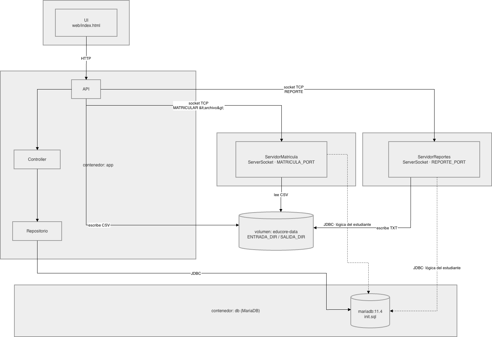

**Entrega:** 2 de Agosto, 2026, 11:59 PM · **Tag de entrega:** `v2.0-p2`
**Modalidad:** grupal · **Valor:** 20%

---

## 0. Contexto: La situación

\begin{infobox}
\textbf{Pónganse en situación.} Lean esta sección antes de saltar a los requisitos. El proyecto no es un ejercicio aislado: es la continuación de lo que ya entregaron en el Proyecto 1.
\end{infobox}

Su versión de EduCore del Proyecto 1 funciona de punta a punta, pero con un problema que la universidad (el cliente real detrás del sistema) no está dispuesta a aceptar en producción: **los datos viven en memoria**. Cada vez que el programa se cierra, la universidad entera desaparece: estudiantes, empleados, edificios, secciones, todo. Ningún centro educativo puede operar así, y la universidad lo dejó claro: exige **persistencia real** antes de seguir adelante, además de dos procesos administrativos que hasta ahora se hacían a mano: matricular estudiantes en lote desde un archivo, y generar reportes del estado del sistema.

Para resolver esto, la empresa trajo de vuelta, por un tiempo corto, al **equipo original** que arrancó el proyecto en el Proyecto 1, el mismo que dejó el módulo de referencia de Estudiantes. Su tarea fue construir la infraestructura que hacía falta: el **frontend web** (una SPA, *Single Page Application*, la interfaz que ven en el navegador), el **servidor API** que la sirve, **MariaDB** corriendo en Docker como base de datos, y los **Dockerfiles/`docker-compose.yml`** que levantan todo el stack. También dejaron, otra vez, el módulo de Estudiante como referencia, ahora hablando con la base de datos real en lugar de una lista en memoria.

Antes de que ese equipo pudiera conectar el resto de la lógica de negocio a esa infraestructura, la empresa **los reasignó de nuevo** a otro proyecto urgente. El desarrollo quedó, otra vez, a medio camino, pero esta vez a medio camino de otra forma: la infraestructura y la interfaz están listas y funcionando; lo que falta es la lógica que las conecta con datos reales.

Ahí entran ustedes, de vuelta. No empiezan de cero: heredan una base más grande (SPA, API, Docker, MariaDB) construida sobre el mismo modelo de dominio que ya diseñaron en P1. Su misión en el Proyecto 2 es **migrar la persistencia** de los tres módulos que diseñaron en P1 (Empleados, Edificios/Aulas, Secciones) de memoria a base de datos, y **construir los dos procesos nuevos** que la universidad pidió: matrícula por lote y reportes.

\begin{tipbox}
\textbf{Qué NO es su trabajo en P2.} La SPA, el servidor API (sus rutas y su forma), los \texttt{Dockerfile} y el \texttt{docker-compose.yml} ya están resueltos y no se tocan. Todo lo que sí es su trabajo cae en cuatro técnicas concretas: \textbf{SQL} (persistencia real vía JDBC), \textbf{sockets} (los servicios de matrícula y reportes), \textbf{manejo de archivos} (leer el CSV de matrícula, escribir el TXT de reportes) y \textbf{excepciones} (para el manejo de errores del lote de matrícula). La sección 1.2 detalla exactamente el alcance.
\end{tipbox}

\begin{tipbox}
\textbf{Su ventaja:} ya diseñaron el modelo de dominio en P1 y quedó bien evaluado, lo que significa que sus clases \texttt{Empleado}, \texttt{Edificio}, \texttt{Aula} y \texttt{Seccion} no cambian en P2. Lo que cambia es únicamente \textbf{cómo se guardan}. Si en P1 separaron bien sus capas (Controller sin saber de la vista, DAO como única capa que toca datos), P2 es sobre todo trabajo nuevo en la capa DAO, no una reescritura.
\end{tipbox}

A continuación, el enunciado formal del Proyecto 2.

---

## 1. Introducción

### 1.1 Propósito

Este documento especifica los requisitos que el sistema EduCore debe cumplir al término del Proyecto 2. Sirve como referencia única para el diseño, la implementación y la evaluación del trabajo.

### 1.2 Alcance

El Proyecto 2 no agrega módulos de dominio nuevos: reutiliza el modelo diseñado en P1 (Empleado, Edificio, Aula, Sección, y Estudiante ya resuelto). Extiende el sistema backend en tres frentes funcionales, apoyados en cuatro técnicas concretas.

**Ya resuelto, no lo modifican:**

- El frontend (SPA, `index.html`).
- El servidor API (`ServidorApi`: rutas Javalin, DTOs, el puente HTTP->socket de matrícula y reportes).
- Los `Dockerfile` y `docker-compose.yml` (infraestructura de contenedores, incluyendo MariaDB).
- El módulo de referencia Estudiante sobre SQL (`EstudianteRepoSql`).

**Es su trabajo, usando estas cuatro técnicas:**

1. **SQL (JDBC):** persistencia de Empleados, Edificios/Aulas y Secciones (§3.1).
2. **Sockets:** completar la lógica detrás de `ServidorMatricula` y `ServidorReportes` (§3.2, §3.3).
3. **Manejo de archivos:** leer el CSV de matrícula desde `ENTRADA_DIR`, escribir el `.txt` de reportes en `SALIDA_DIR`.
4. **Excepciones:** modelar y propagar los errores del proceso de matrícula por lote (§3.2; hay puntos extra en §8.4 por diseñar esto bien).

Este enunciado detalla exactamente qué partes del backend faltan por conectar: nada queda a interpretación de "qué toca y qué no".

### 1.3 Glosario

| Término | Definición |
|---|---|
| **SPA** | *Single Page Application*: el frontend web ya construido (`index.html`), servido por el API en `http://localhost:8080/`. Habla con el backend por HTTP/JSON. No la modifican. |
| **DTO** | *Data Transfer Object*: un record que traduce una entidad de dominio al JSON que consume la SPA, y viceversa. Ya están definidos (comentados) en `Dtos.java`. |
| **DAO SQL** | Implementación de `Repositorio<T>` que persiste contra MariaDB en lugar de una lista en memoria, siguiendo el patrón de `EstudianteRepoSql`. |
| **Transacción** | Un conjunto de operaciones SQL que se aplican todas o ninguna (`commit`/`rollback`). Necesaria para que un lote de matrícula no quede a medias si un renglón falla. |
| **Docker Compose** | Orquesta los contenedores del sistema (API, MariaDB, servicio de matrícula, servicio de reportes). Ya está configurado, lo usan para correr y probar, no lo modifican. |

---

## 2. Base del sistema

El repositorio ya contiene los componentes siguientes. No los modifiquen.

### 2.1 Frontend (SPA)

`src/main/resources/web/index.html`: CRUD completo para Estudiantes/Empleados/Edificios/Secciones (incluye editar), subida de CSV para matrícula y descarga de reporte. Ya llama a todas las rutas que ustedes van a activar; no necesita ningún cambio.

### 2.2 Servidor API

| Clase | Descripción |
|---|---|
| `ServidorApi` | Arma las rutas Javalin. Las de Empleados/Edificios/Secciones devuelven `501 pendiente de implementar`, cada una trae, comentado, un ejemplo exacto de qué código va ahí (ver los `TODO(estudiante · P1)`). |
| `Dtos` | Los records `EmpleadoDto`/`EmpleadoRequest`, `EdificioDto`/`AulaDto`/`AulaRequest`, `SeccionDto`/`SeccionRequest`/`InscripcionRequest` ya están escritos, comentados. **Es el contrato fijo con la SPA, no cambien nombres de campos.** |
| `MatriculaRequest` | Ya activo: `archivo` (nombre del CSV) y `contenido` (texto del CSV que sube la SPA). |

### 2.3 Referencia: módulo Estudiante sobre SQL

| Clase | Descripción |
|---|---|
| `ConfiguracionBD` | Lee `DB_HOST`, `DB_NAME`, `DB_USER`, `DB_PASSWORD` de `.env` y arma la URL JDBC. El puerto interno de conexión es siempre `3306` (la red de Docker), sin importar `DB_HOST_PORT` en su `.env`. |
| `Conexion` | Fábrica de conexiones: `Conexion.getConnection(url, usuario, contrasena)`. Cada llamada abre una conexión **nueva**; ciérrenla con try-with-resources. |
| `EstudianteRepoSql` | Implementación de referencia de `Repositorio<Estudiante>` contra la tabla `estudiante`. **Repliquen este patrón** para sus DAOs SQL. |

### 2.4 Infraestructura Docker

Todo lo de esta sección ya está configurado, no lo modifican. Se las explicamos porque van a correr y depurar el proyecto sobre esto durante toda la entrega.

```
                        HTTP :8080 (JSON)
   [ Navegador / SPA ] <-----------------> [ app ]
                                              ServidorApi (Javalin)
                        +---------------------+---------------------+
                        |                                           |
              socket :9001 (MATRICULAR)                  socket :9002 (REPORTE)
                        |                                           |
                 [ matricula ]                              [ reportes ]
               ServidorMatricula                            ServidorReportes
             (mismo jar que app, solo                     (mismo jar que app, solo
              cambia el comando)                            cambia el comando)
                        |                                           |
                        +---------------- JDBC :3306 ----------------+
                                              |
                                           [ db ]
                                         MariaDB 11.4
                                    (db/init.sql se aplica una
                                     sola vez, al crear el volumen)

  Volumen educore-data:/data (compartido entre app, matricula y reportes)
    ENTRADA_DIR=/data/entrada  -> CSV de matrícula que sube la SPA
    SALIDA_DIR=/data/salida    -> reportes .txt generados

  .env (no se commitea) -> montado de solo lectura en los 3 servicios Java:
    credenciales de BD, host/puerto de matricula y reportes, ENTRADA_DIR/SALIDA_DIR
```

| Servicio | Se construye con | Qué corre | Puerto |
|---|---|---|---|
| `db` | imagen `mariadb:11.4` | MariaDB, inicializada una vez con `db/init.sql` | `DB_HOST_PORT` (host) -> `3306` (interno) |
| `app` | `Dockerfile` del repo | `Main` -> `ServidorApi` (Javalin + SPA) | `API_PORT` (host) -> `8080` |
| `matricula` | mismo `Dockerfile` | `ServidorMatricula` (servidor de socket) | interno, sin exponer al host |
| `reportes` | mismo `Dockerfile` | `ServidorReportes` (servidor de socket) | interno, sin exponer al host |

**El `Dockerfile` es multi-stage y lo reutilizan los tres servicios Java** (`app`, `matricula`, `reportes`):

1. Etapa `build` (imagen con Maven): corre `mvn package` y produce `app.jar`.
2. Etapa runtime (imagen liviana, solo JRE): copia ese `app.jar`, sin dejar Maven ni el código fuente adentro.

Los tres servicios corren exactamente el mismo `app.jar`, lo único que cambia entre ellos es el `command:` de `docker-compose.yml`, que le dice al contenedor qué clase con `main` ejecutar (`edu.uam.educore.Main`, `ServidorMatricula` o `ServidorReportes`).

**Otras piezas ya configuradas** que conviene reconocer al leer `docker-compose.yml`:

- `db` tiene `healthcheck`; `app`, `matricula` y `reportes` esperan a que MariaDB esté lista (`depends_on: condition: service_healthy`) antes de arrancar.
- Volumen `educore-db-data`: persiste los datos de MariaDB entre reinicios del stack, es lo que hace posible RF-01.4.
- Volumen `educore-data:/data`, compartido entre `app`, `matricula` y `reportes`: así se pasan el CSV de matrícula y los reportes generados entre contenedores sin usar red, vía `ENTRADA_DIR`/`SALIDA_DIR`.
- `.env` se monta de solo lectura (`:ro`) en los tres servicios Java, nunca va horneado en la imagen ni hardcodeado en el código (RNF-05).

#### Cómo levantar y reconstruir

| Comando | Cuándo usarlo |
|---|---|
| `docker compose up` | La primera vez, o si no cambiaron código Java desde la última build. |
| `docker compose up --build` | Después de **cualquier cambio en el código Java**. Docker cachea la etapa `build` del `Dockerfile`; sin `--build` el stack sigue corriendo el `app.jar` viejo aunque el código ya haya cambiado, es la causa más común de "hice el cambio pero no se refleja". |
| `docker compose up --build --force-recreate` | Si `--build` solo no basta (p. ej. cambiaron algo en `.env` y algún contenedor no lo recogió). Fuerza reconstruir la imagen **y** recrear los contenedores desde cero. |
| `docker compose logs -f matricula` (o `reportes`, `app`) | Para depurar `matricula`/`reportes`: no exponen puerto al host, así que la única forma de ver qué pasó (o si el contenedor murió al arrancar) es el log. |
| `docker compose down` | Baja el stack conservando los volúmenes, los datos de la BD y de `/data` siguen ahí para la próxima. |

\begin{tipbox}
\textbf{Nunca usen \texttt{docker compose down -v}} como parte del flujo normal de desarrollo: el \texttt{-v} borra también los volúmenes, incluyendo \texttt{educore-db-data}. Si lo corren sin querer van a "perder" todo lo que tenían guardado y pueden confundirlo con un bug de persistencia al verificar RF-01.4. Resérvenlo para cuando quieran reiniciar la base de datos desde cero a propósito (por ejemplo, después de editar \texttt{db/init.sql}, que solo se aplica al crear el volumen por primera vez, si ya existe, un \texttt{docker compose up} normal no vuelve a correrlo).
\end{tipbox}

### 2.5 Diagramas

Dos vistas complementarias de lo mismo descrito en la sección 2.4: quién le habla a quién, y dónde vive cada archivo.

**Arquitectura y flujo de datos:**



**Distribución de archivos del repositorio** (rutas relevantes para P2; se omiten archivos que no tocan):

```
educore/
├── docker-compose.yml          (db · app · matricula · reportes)
├── Dockerfile
├── pom.xml
├── db/
│   └── init.sql                 ← ustedes agregan las tablas nuevas acá (§2.6)
├── docs/
│   ├── enunciado-p1.md / .pdf
│   ├── enunciado-p2.md / .pdf
│   └── documentacion-p2.pdf     ← su PDF de entrega (§7.2)
└── src/
    ├── main/
    │   ├── java/edu/uam/educore/
    │   │   ├── Main.java                      ← entry point (arranca ServidorApi)
    │   │   ├── api/
    │   │   │   ├── ServidorApi.java            ← rutas HTTP (Javalin), puente HTTP→socket
    │   │   │   └── Dtos.java
    │   │   ├── controller/
    │   │   │   └── EstudianteController.java   ← único controlador fijo (docente)
    │   │   ├── dao/
    │   │   │   ├── Repositorio.java             (interfaz)
    │   │   │   ├── EstudianteRepoSql.java        (JDBC, patrón de referencia)
    │   │   │   └── ListaEstudianteRepo.java      (fallback en memoria si `.env` no está disponible; solo desarrollo local)
    │   │   ├── db/
    │   │   │   ├── Conexion.java
    │   │   │   └── ConfiguracionBD.java
    │   │   ├── model/personas/
    │   │   │   ├── Persona.java
    │   │   │   ├── Estudiante.java
    │   │   │   ├── EstudianteRegular.java
    │   │   │   └── EstudianteBecado.java
    │   │   ├── socket/
    │   │   │   ├── ServidorMatricula.java       ← main propio, escucha MATRICULA_PORT
    │   │   │   └── ServidorReportes.java        ← main propio, escucha REPORTE_PORT
    │   │   ├── util/
    │   │   │   └── Validador.java
    │   │   └── view/
    │   │       ├── VistaBase.java
    │   │       ├── EstudianteView.java
    │   │       └── MenuPrincipalView.java
    │   └── resources/web/
    │       └── index.html                       ← UI servida por ServidorApi
    └── test/java/edu/uam/educore/
        ├── api/DtosTest.java
        └── model/personas/{EstudianteRegularTest,EstudianteBecadoTest}.java
```

No hay directorios propios de Empleado, Edificio o Sección en este árbol porque cada grupo trae los suyos desde su repositorio de P1, el árbol de arriba muestra solo lo que ya existe en el esqueleto de P2.

### 2.6 Esquema de base de datos

`db/init.sql` solo tiene la tabla `estudiante`. Ustedes agregan ahí las tablas que necesiten para Empleado, Edificio, Aula, Sección y Matrícula, consistentes con los atributos que ya definieron en P1 y con los campos que esperan los DTOs de la sección 2.2.

> **Una sola tabla `matricula`.** Hay dos caminos que escriben la relación estudiante<->sección: inscribir/remover individual desde la SPA (RF-01.3, vía el DAO SQL de Sección) y la matrícula por lote (§3.2, vía `ServidorMatricula`). Ambos deben leer y escribir la **misma** tabla `matricula`, no diseñen una tabla de unión aparte para uno de los dos caminos, o el cupo y los duplicados van a quedar inconsistentes entre la SPA y el CSV.

---

## 3. Persistencia y lógica de negocio a implementar

### 3.1 Persistencia SQL: Empleados, Edificios/Aulas, Secciones

Para cada uno de los tres módulos:

1. **No toquen su `Model` ni su `Controller` de P1** (si están bien separados de la vista/persistencia, no necesitan cambiar).
2. Escriban un DAO SQL nuevo (ej. `EmpleadoRepoSql`) que implemente `Repositorio<T>` contra MariaDB, siguiendo el patrón de `EstudianteRepoSql` (§2.3).
3. Agreguen la tabla correspondiente a `db/init.sql`.
4. En `ServidorApi`, descomenten el bloque de rutas de ese módulo y conecten su Controller (instanciado con el DAO SQL nuevo), reemplazando el `501`.
5. En `Dtos.java`, descomenten el record `...Request`/`...Dto` de ese módulo y su método `desde(...)`, ajustando los getters a los nombres reales de su clase si difieren.

> **Composición Edificio->Aula (recordatorio de P1).** El aula no tiene tabla propia con repositorio aparte a nivel de dominio: sigue viviendo dentro de su edificio. En SQL esto se traduce en una tabla `aula` con `edificio_id` como llave foránea; el `id` de aula debe seguir siendo único a nivel de todo el sistema (no reiniciar por edificio), porque `SeccionController` lo busca recorriendo edificios.

### 3.2 Matrícula por lote

Completar `ServidorMatricula.procesarLote(String archivo)`.

**Formato del archivo** (en `ENTRADA_DIR`, una matrícula por línea):
```
carnet,codigoSeccion
202410000001,PROG3-01
202410000002,PROG3-01
```

**Comportamiento esperado:**

- Se abre **una transacción** (`con.setAutoCommit(false)`) para todo el lote.
- Por cada línea, en orden:
  1. Buscar el estudiante por `carnet`. Si no existe -> error, se revierte el lote completo.
  2. Buscar la sección por `codigoSeccion` y su cupo (`aula.capacidad` de la sección, vía el `aula_id` de la sección). Si la sección no existe -> error, se revierte el lote completo.
  3. Si la sección ya tiene tantos inscritos como su capacidad -> **cupo lleno**, se revierte el lote completo.
  4. Si el estudiante ya está matriculado en esa sección -> **matrícula duplicada**, se revierte el lote completo.
  5. Si todo pasa, insertar la matrícula.
- Si **todas** las líneas pasan: `commit()` y devolver la cantidad matriculada.
- Si **cualquier** línea falla: `rollback()`, ninguna matrícula del lote queda registrada, ni siquiera las líneas anteriores que sí pasaron.

\begin{tipbox}
\textbf{Conexión única para todo el lote.} A diferencia de los DAOs SQL de la sección 3.1 (una conexión nueva por operación, patrón \texttt{EstudianteRepoSql}), aquí necesitan una sola conexión compartida para las cinco operaciones del lote. Si dentro del loop reutilizan sus propios DAOs (que abren su conexión por llamada), el \texttt{commit}/\texttt{rollback} no va a cubrir esas búsquedas, el JDBC de \texttt{procesarLote} va directo sobre esa única conexión, sin pasar por sus DAOs.
\end{tipbox}

El bridge HTTP->socket en `ServidorApi.registrarMatricula` ya viene provisto y activo (es el ejemplo de sockets + archivos del docente): escribe el CSV en `ENTRADA_DIR` y delega el lote a `ServidorMatricula`. Ustedes solo implementan `procesarLote`.

El esqueleto no incluye clases de excepción para los cuatro casos de error, cómo distinguirlos (y con qué mensaje/código responder por el socket) es su decisión de diseño. Diseñar una jerarquía propia da puntos extra (§8.4).

### 3.3 Reportes

Completar `ServidorReportes.generarYGuardar()`.

**Comportamiento esperado:**

- Contar filas de las tablas: estudiante, empleado, sección, aula, matrícula.
- Armar un texto plano con el resumen (una línea por entidad, formato libre pero legible).
- Escribir ese texto como `.txt` en `SALIDA_DIR`, con un nombre que incluya timestamp (para no sobreescribir reportes anteriores).
- Devolver el mismo contenido, es lo que el socket regresa y lo que la SPA descarga.

El bridge HTTP->socket en `ServidorApi.registrarReporte` ya viene provisto y activo (mismo ejemplo del docente): pide el reporte por socket y devuelve el TXT que descarga la SPA. Ustedes solo implementan `generarYGuardar`.

---

## 4. Requisitos funcionales

### RF-01: Persistencia SQL

**RF-01.1** El sistema deberá exponer CRUD completo (listar, crear, actualizar, eliminar) de Empleados vía `/api/empleados`, persistiendo en MariaDB.

**RF-01.2** El sistema deberá exponer CRUD completo de Edificios (incluyendo agregar aulas) vía `/api/edificios`, persistiendo en MariaDB, manteniendo la integridad referencial ya exigida en P1 (no eliminar un edificio con aulas).

**RF-01.3** El sistema deberá exponer CRUD completo de Secciones (incluyendo inscribir/remover estudiantes) vía `/api/secciones`, persistiendo en MariaDB, manteniendo las validaciones de P1 (docente debe ser `DOCENTE`, IDs de aula/empleado/estudiante deben existir, integridad referencial al eliminar).

**RF-01.4** Los datos deberán sobrevivir un reinicio del contenedor `db` (persistencia real, no en memoria): crear una entidad, bajar y subir `docker compose`, y verificar que sigue ahí.

**RF-01.5** El contrato de datos con la SPA (`Dtos.java`) no deberá modificarse en nombres de campo ni tipos.

---

### RF-02: Matrícula por lote

**RF-02.1** El sistema deberá matricular un lote completo de estudiantes desde un archivo CSV subido por la SPA, en una única transacción.

**RF-02.2** El sistema deberá rechazar el lote completo (rollback) si cualquier línea referencia un carnet inexistente.

**RF-02.3** El sistema deberá rechazar el lote completo si cualquier línea referencia un código de sección inexistente.

**RF-02.4** El sistema deberá rechazar el lote completo si cualquier línea excede el cupo de una sección (cupo = capacidad del aula asignada).

**RF-02.5** El sistema deberá rechazar el lote completo si cualquier línea intenta matricular a un estudiante ya inscrito en esa sección.

**RF-02.6** Ante un lote válido, el sistema deberá confirmar la cantidad de matrículas procesadas.

---

### RF-03: Reportes

**RF-03.1** El sistema deberá generar, bajo demanda, un reporte con el conteo de estudiantes, empleados, secciones, aulas y matrículas.

**RF-03.2** El sistema deberá persistir cada reporte generado como archivo `.txt` en `SALIDA_DIR`, sin sobreescribir reportes anteriores.

**RF-03.3** El sistema deberá permitir descargar el reporte generado desde la SPA.

---

## 5. Requisitos no funcionales

**RNF-01: Formato de código**
Antes de cada commit ejecutar `mvn fmt:format` sobre los archivos modificados. El tag de entrega debe pasar `mvn fmt:check` sin errores.

**RNF-02: Verificación**
No se exige una suite de tests JUnit nueva contra la base de datos. En su lugar, el grupo documenta en el PDF evidencia de cada flujo verificado manualmente (vía SPA o `curl`): CRUD de los tres módulos sobreviviendo un reinicio del stack, matrícula con cada uno de los 4 casos de error de RF-02, y descarga de un reporte.

**RNF-03: Separación de capas (continuidad de P1)**
El Controller no debe tener referencia a JDBC, HTTP ni clases del framework web. Toda la lógica de conexión y SQL vive en el DAO. Si su Controller de P1 cumplía esto, no necesita cambios en P2.

**RNF-04: Transacciones**
Cualquier operación que module varias filas relacionadas como una unidad (matrícula por lote) debe usar `setAutoCommit(false)` + `commit()`/`rollback()`, nunca *auto-commit* por fila.

**RNF-05: Credenciales**
Ninguna URL, usuario o contraseña de base de datos va hardcodeada en el código. Se leen de `.env` a través de `ConfiguracionBD`, igual que en `EstudianteRepoSql`.

---

## 6. Flujo de trabajo con Git

### 6.1 Sincronizar con la base de P2

La base de P2 (Docker + MariaDB + SPA + skeleton del API) está publicada en el repositorio original como el tag `v1.0`, la misma idea que `v0.0` para la base de P1.

El `main` de su fork y el `main` del repositorio original **divergieron**: el suyo tiene por delante sus propios commits de P1, y le faltan los commits nuevos de P2. Es la situación normal al sincronizar un fork después de trabajar en él, no hay que rehacer nada, se resuelve con un merge.

```bash
git checkout main
git fetch upstream --tags
git merge v1.0
```

Si `git fetch upstream` falla porque no tienen ese remote (se agrega en P1), créenlo primero:
```bash
git remote add upstream https://github.com/jocoto14/educore.git
```

El merge casi seguro marca **conflicto en `Main.java`**: en P1 lo modificaron para arrancar su menú de consola; en P2 pasa a arrancar el servidor API (`ServidorApi.iniciar`). Es el único archivo que la mayoría de los grupos tocó en P1 y que la base de P2 también cambia.

\begin{tipbox}
\textbf{Cómo resolver el conflicto de \texttt{Main.java}, en 4 pasos:}
1. Ábranlo. Van a ver marcas \texttt{<<<<<<<}, \texttt{=======}, \texttt{>>>>>>>} alrededor de las dos versiones.
2. Quédense con el lado que llama a \texttt{ServidorApi.iniciar(puerto)} (el de \texttt{v1.0}) y borren su menú de consola: en P2 la consola se retira, todo pasa por la SPA en el navegador.
3. Borren a mano las tres líneas de marcas (\texttt{<<<<<<<}, \texttt{=======}, \texttt{>>>>>>>}); no se les puede quedar ninguna en el archivo.
4. \texttt{git add src/main/java/edu/uam/educore/Main.java} y luego \texttt{git commit} (acepten el mensaje que Git propone, no hace falta escribir uno nuevo).
\end{tipbox}

Si aparece algún otro conflicto (por ejemplo en `pom.xml`), la regla general: quédense con **su** versión en todo lo que sea su modelo de dominio (Empleado, Edificio, Aula, Seccion), y con la versión **entrante** (`v1.0`) en todo lo de infraestructura (`api/`, `socket/`, `db/`, Docker, dependencias nuevas del `pom.xml`).

Terminado el merge, verifiquen que compila y suban el resultado a su fork:
```bash
mvn compile
git push origin main
```

### 6.2 Durante el desarrollo

Cada integrante trabaja en su propia rama. La distribución del trabajo (quién migra qué módulo, quién implementa matrícula/reportes) es **decisión del grupo**, no tiene que ser una rama por persona por módulo; organícense como les funcione.

```bash
git checkout -b feat/p2-<lo-que-estén-migrando>
```

Antes de cada commit, formatear los archivos modificados:
```bash
mvn fmt:format
```

### 6.3 Entrega

1. Mergear todas las ramas a `main` del fork.
2. Verificar:
   ```bash
   mvn fmt:check
   docker compose up
   ```
   y probar los flujos de la sección 4 desde la SPA.
3. Crear el tag anotado y pushearlo:
   ```bash
   git tag -a v2.0-p2 -m "Entrega Proyecto 2 - [Nombres del equipo]"
   git push origin v2.0-p2
   ```
4. Comprobar que `git checkout v2.0-p2` seguido de `docker compose up` levanta el sistema completo.

El profesor debe seguir como colaborador en sus repositorios bajo el username `jocoto14`.

---

## 7. Entregables

Hay **dos entregas separadas** para el mismo trabajo: el repositorio de GitHub (igual que en P1) y un zip en Campus Virtual (nuevo en P2, ver §7.3). Ambas deben corresponder exactamente al mismo estado del proyecto, el del tag `v2.0-p2`.

### 7.1 Repositorio (GitHub)

Todo debe estar accesible al hacer `git checkout v2.0-p2` sobre `main`, en su fork.

- Persistencia SQL de Empleados, Edificios/Aulas y Secciones, según los requisitos de la sección 4.
- Matrícula por lote y Reportes implementados según la sección 3.2 y 3.3.
- `mvn fmt:check` sin errores.
- `docker compose up` levanta el sistema completo desde el tag.
- Historial de commits con trabajo de los tres integrantes desde sus ramas.
- Tag `v2.0-p2` presente y pusheado.
- La carpeta `docs/` con el PDF de documentación (sección 7.2) agregado, por ejemplo como `docs/documentacion-p2.pdf`.

No hay ítem de README que actualizar ni calificar: a partir de este proyecto, **la única documentación de entrega es el PDF** de la sección 7.2. El `README.md` del repositorio sigue existiendo como guía técnica genérica (cómo clonar, compilar, etc.), pero no forma parte de lo que se evalúa en P2.

### 7.2 PDF de documentación

Un único PDF dentro de `docs/`. Debe incluir:

- **Portada:** nombres de los integrantes, grupo, instrumento, fecha.
- **Distribución de tareas:** quién migró qué módulo, quién implementó matrícula/reportes.
- **Evidencia de verificación manual** (RNF-02): capturas o descripción de cada flujo probado, incluyendo los 4 casos de error de matrícula.
- **Instrucciones de uso:** cómo levantar el sistema (`docker compose up`) y cómo operar cada flujo desde la SPA (CRUD de cada módulo, subir el CSV de matrícula, descargar un reporte). Escritas para alguien que abre el proyecto por primera vez y no conoce el código, no basta con repetir los comandos de la sección 2.4, hay que explicar qué se espera ver en la pantalla en cada paso.
- **Uso de IA:** qué herramientas usaron, qué decidió el grupo, qué aprendieron, qué harían diferente. Si no usaron IA, indicarlo explícitamente. Todo código no generado por ustedes debe justificarse con: fuente, por qué fue usado y qué ventaja les trajo.

### 7.3 Campus Virtual (zip)

Además de la entrega por Git, deben subir a la tarea correspondiente de Campus Virtual **un único archivo `.zip`** que contenga:

- El código fuente completo del repositorio, en el estado exacto del tag `v2.0-p2`.
- La carpeta `docs/` completa, con el PDF de la sección 7.2 adentro.
- La carpeta **`.git/`** completa (no la excluyan ni la ignoren al comprimir), es la evidencia verificable del historial de commits real (ramas, autores, fechas) sin depender de que el repositorio de GitHub siga accesible.

Para generarlo, comprima la carpeta raíz del proyecto tal cual (incluyendo `.git/`) después de haber hecho el `checkout` del tag; no reconstruyan el repositorio a mano ni lo empaqueten sin `.git/`, porque entonces no se puede verificar autoría ni historial.

---

## 8. Rúbrica

El proyecto vale el **20% de la nota del curso**. La rúbrica se expresa sobre **100 puntos**; la nota del proyecto es esos puntos llevados al 20%.

### 8.1 Cómo se califica

| Nivel | Significado |
|---|---|
| **2 · Logrado** | Cumple completo y funcional. |
| **1 · Parcial** | Cumple lo esencial, con defectos acotados. |
| **0 · No logrado** | Ausente, no compila, no corre, o incumple. |

Se evalúa únicamente lo que esté en el tag `v2.0-p2`, corriendo vía `docker compose up`. Si el stack no levanta sobre el tag, los ítems de funcionalidad que requieren ejecución no pueden superar nivel 1.

### 8.2 Pesos por criterio

| # | Criterio | Puntos | Trazabilidad |
|---|---|---|---|
| A | Persistencia SQL | 25 | RF-01 |
| B | Matrícula por lote | 25 | RF-02, RNF-04 |
| C | Reportes | 15 | RF-03 |
| D | Diseño OO y separación de capas | 10 | RNF-03, RNF-05 |
| E | Git y entrega | 10 | §6 |
| F | PDF de documentación | 15 | §7 |
| | **Total** | **100** | |

---

### A · Persistencia SQL · 25 pts

| Ítem | Evidencia observable | Nivel (0-2) |
|---|---|---|
| A1 | CRUD de Empleados funcional vía SPA/API, persistido en MariaDB. | |
| A2 | CRUD de Edificios/Aulas funcional, con integridad referencial (RF-01.2). | |
| A3 | CRUD de Secciones funcional, con todas las validaciones de P1 (docente `DOCENTE`, IDs existentes, integridad referencial). | |
| A4 | Los datos sobreviven un reinicio del stack (RF-01.4). | |

**Nivel 1:** un módulo funciona parcialmente (ej. crea pero no actualiza), o los datos no sobreviven un reinicio.

---

### B · Matrícula por lote · 25 pts

| Ítem | Evidencia observable | Nivel (0-2) |
|---|---|---|
| B1 | Lote válido se matricula completo y se confirma la cantidad. | |
| B2 | Carnet o sección inexistente rechaza el lote completo (rollback verificable: nada queda registrado). | |
| B3 | Cupo lleno rechaza el lote completo. | |
| B4 | Matrícula duplicada rechaza el lote completo. | |

**Nivel 1:** el camino feliz funciona pero algún caso de error no revierte el lote completo (deja matrículas parciales).

---

### C · Reportes · 15 pts

| Ítem | Evidencia observable | Nivel (0-2) |
|---|---|---|
| C1 | Conteo correcto de las 5 entidades. | |
| C2 | Archivo `.txt` persistido en `SALIDA_DIR` sin sobreescribir reportes anteriores. | |
| C3 | Descarga funcional desde la SPA. | |

**Nivel 1:** el conteo es correcto pero no se persiste el archivo, o se sobreescribe el anterior.

---

### D · Diseño OO y separación de capas · 10 pts

| Ítem | Evidencia observable | Nivel (0-2) |
|---|---|---|
| D1 | Controllers de P1 reutilizados sin lógica JDBC/HTTP filtrada dentro. | |
| D2 | DAOs SQL siguen el patrón de `EstudianteRepoSql` (conexión nueva por operación, try-with-resources). | |
| D3 | Credenciales leídas de `.env`, ninguna hardcodeada (RNF-05). | |

**Nivel 1:** separación respetada salvo en un punto puntual (ej. una query armada con concatenación insegura, o una conexión no cerrada).

---

### E · Git y entrega · 10 pts

| Ítem | Evidencia observable | Nivel (0-2) |
|---|---|---|
| E1 | Ramas por módulo con commits de los tres integrantes. | |
| E2 | Tag `v2.0-p2` presente, pusheado, y `docker compose up` levanta el sistema desde ese tag. | |
| E3 | `mvn fmt:check` pasa sin errores sobre el tag. | |

**Nivel 1:** tag creado pero el checkout no levanta correctamente, o todo el trabajo en una sola rama.

---

### F · PDF de documentación · 15 pts

| Ítem | Evidencia observable | Nivel (0-2) |
|---|---|---|
| F1 | Portada y distribución de tareas por integrante/módulo. | |
| F2 | Evidencia de verificación manual de cada flujo (RNF-02), incluyendo los 4 casos de matrícula. | |
| F3 | Instrucciones de uso completas: cómo levantar el sistema y cómo operar cada flujo desde la SPA, escritas para alguien que no conoce el proyecto (§7.2). | |
| F4 | Uso de IA: herramientas usadas, qué decidió el grupo, qué aprendieron; todo código externo justificado con fuente y motivo. | |

**Nivel 1:** secciones descriptivas en vez de justificadas, evidencia de verificación incompleta (falta algún caso de error), o instrucciones de uso incompletas/ambiguas.

---

### 8.3 Nota final

```
Nota P2 (%) = (puntos obtenidos ÷ 100) × 20
```

---

### 8.4 Puntos extra

| Ítem | Evidencia observable | Puntos |
|---|---|---|
| Bonus-1 | `procesarLote` distingue los cuatro casos de error de la sección 3.2 (carnet inexistente, sección inexistente, cupo lleno, matrícula duplicada) mediante una jerarquía de excepciones propia (checked, con una excepción base y una subclase por caso), documentada y justificada en el PDF. | 5 |

Este bonus se suma **después** de calcular el 20% de la nota P2 (§8.3), no forma parte de los 100 puntos de la rúbrica. El esqueleto no provee estas clases a propósito: el diseño de cómo modelar y propagar estos errores es su decisión.
